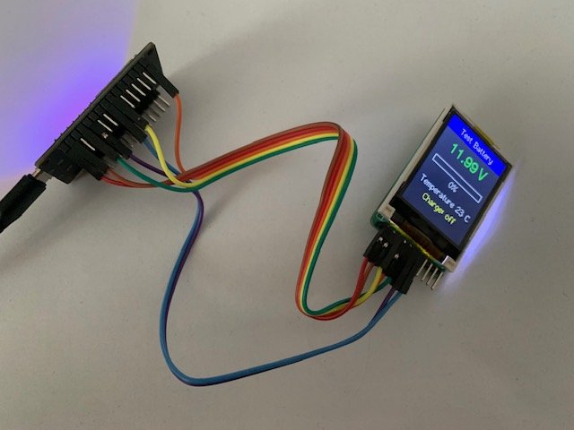

# Battery Guard Multi-Device Monitor

ESP32-based BLE monitor for up to 4 Battery Guard devices simultaneously with optional 1.8" ST7735 LCD display. Supports automatic device discovery, encrypted communication, and real-time battery monitoring.



## Features

- ✅ **Multi-Device Support** - Monitor up to 4 Battery Guard devices in parallel
- ✅ **LCD Display** - 1.8" ST7735 TFT display with auto-rotate every 15 seconds
- ✅ **Automatic Discovery** - Continuously scans for devices as they come and go
- ✅ **Auto-Reconnection** - Automatically reconnects when devices power cycle
- ✅ **Encrypted Communication** - AES-128-CBC handshake protocol
- ✅ **Real-time Monitoring** - Voltage, State of Charge (SOC), Temperature, Status
- ✅ **Progress Bar Display** - Visual SOC representation on LCD
- ✅ **Retry Logic** - 3 connection attempts with 30-second cooldown period
- ✅ **Clean Output** - Production mode with optional debug logging

## Hardware Requirements

- **ESP32 Development Board** (tested with DOIT ESP32 DEVKIT V1)
- **Battery Guard BLE Device(s)** (50:54:7B:XX:XX:XX)
- **Optional: 1.8" ST7735 LCD Display** (128x160 pixels, SPI interface)
- USB cable for programming

### LCD Wiring (Optional)

| ST7735 Pin | ESP32 Pin |
|------------|-----------|
| VCC        | 3.3V      |
| GND        | GND       |
| CS         | GPIO 5    |
| RST        | GPIO 4    |
| DC         | GPIO 2    |
| MOSI       | GPIO 23   |
| SCLK       | GPIO 18   |

## Software Requirements

- [PlatformIO](https://platformio.org/) (VS Code extension or CLI)
- [NimBLE-Arduino](https://github.com/h2zero/NimBLE-Arduino) library (auto-installed)
- AES key, hardcoded in App. Decompile the Android APK to find it

## Quick Start

### 1. Clone and Setup

```bash
cd "Battery Guard Demo"
cp include/config.h.sample include/config.h
```

### 2. Configure Devices

Edit `include/config.h`:

```cpp
const DeviceConfig DEVICES[] = {
    {
        .serial = "50547B815AFB",    // Your device MAC (no colons)
        .name = "Main Battery",
        .mqttName = "battery1",             // MQTT topic name (no spaces, lowercase recommended)
        .type = LEAD_ACID,           // or AGM, LITHIUM, etc.
        .enabled = true
    },
    // Add up to 3 more devices...
};
```

**Finding your device MAC:**
- it is printed on device
- Enter the correct AES key. Otherwise BLE communication wont work.

### 3. Build and Upload

**Production mode (no LCD):**
```bash
platformio run -e release --target upload
```

**Production mode with LCD:**
```bash
platformio run -e release-lcd --target upload
```

**Debug mode (detailed logging, no LCD):**
```bash
platformio run -e debug --target upload
```

**Debug mode with LCD:**
```bash
platformio run -e debug-lcd --target upload
```

### 4. Monitor Serial Output

```bash
platformio device monitor -b 115200
```

## LCD Display

When using the `release-lcd` or `debug-lcd` environment, the ST7735 display shows:

**Startup Screen:**
- "Battery" / "Guard" (2 lines)
- "Connecting...." below

**Data Screen** (per device):
- **Header**: Device name (blue background)
- **Voltage**: Large green text (e.g., "10.99 V")
- **SOC**: Progress bar + percentage
- **Temperature**: Centered (e.g., "Temperature 23 C")
- **Status**: Centered, yellow text (e.g., "Charge: off", "Charge: on")

**Auto-Rotation:**
- Switches between connected devices every 15 seconds
- Shows only connected devices
- Returns to startup screen when all devices disconnect

## Configuration

### Device Types (include/types.h)

```cpp
LEAD_ACID           // Standard Lead Acid (6-write handshake)
AGM                 // AGM Battery (6-write handshake)
LITHIUM             // Lithium Standard (6-write handshake)
OTHER_INTELLIGENT   // Other + Intelligent mode (7-write handshake)
OTHER_MANUAL        // Other + Manual mode (7-write handshake)
LITHIUM_INTELLIGENT // Lithium + Intelligent (7-write handshake)
LITHIUM_MANUAL      // Lithium + Manual (7-write handshake)
```

### Adjustable Parameters (include/config.h)

```cpp
SCAN_INTERVAL           // BLE scan interval (default: 62.5ms)
SCAN_WINDOW             // BLE scan window (default: 50ms)
CONNECT_TIMEOUT_MS      // Connection timeout (default: 10s)
MAX_CONNECT_RETRIES     // Retry attempts (default: 3)
RETRY_COOLDOWN_MS       // Cooldown period (default: 30s)
NOTIFICATION_TIMEOUT_MS // Data timeout (default: 60s)
```

## Serial Output

### Production Mode (Release)

```
============================================================
Battery Guard Multi-Device Monitor
============================================================
[Main Battery] Initialized: 50547B815AFB (Type: 0x01)

Monitoring 1 device(s):
  [1] Main Battery (50547B815AFB) - Type: 0x01
============================================================

[Main Battery] Found device: 50:54:7b:81:5a:fb - STOPPING SCAN!
[Main Battery] Connecting to 50:54:7b:81:5a:fb...
[Main Battery] Connected!
[Main Battery] Connected successfully!
[Main Battery] Handshake complete, waiting for notifications...

Main Battery (50547B815AFB): 11.99V | 42% | 23°C | normal | VRise:0 | VDrop:2
Main Battery (50547B815AFB): 11.98V | 41% | 23°C | normal | VRise:0 | VDrop:2
```

### Debug Mode

Enable with:
```bash
platformio run -e debug --target upload
```

Shows detailed information:
- Timestamp for each operation `[XXX.XXs]`
- All BLE scan results
- Connection attempts and durations
- Handshake write operations (encrypted data)
- Notification decryption (plaintext bytes)
- State transitions

## State Machine

```
DISCONNECTED → SCANNING → CONNECTING → HANDSHAKE → MONITORING
                    ↑                                    ↓
                    └────────────────────────────────────┘
                              (on disconnect)
                    
After 3 failed attempts → COOLDOWN (30s) → back to SCANNING
```

## Protocol Details

### BLE Characteristics

- **Service UUID:** `0xFFF0`
- **Write Characteristic:** `0xFFF3` (Handshake)
- **Notify Characteristic:** `0xFFF4` (Data)

### Handshake Sequence

6-write encrypted sequence (LEAD_ACID/AGM):
1. Device type initialization
2. Battery type setting
3. Parameter configuration (voltage thresholds)
4. Parameter configuration (current thresholds)
5. Mode setting
6. Finalization

All writes use AES-128-CBC encryption with static key.

### Data Format

Notifications arrive every ~1 second (16-byte encrypted, AES-128-CBC):

**Plaintext Structure (from Android app analysis):**

| Byte | Field | Description | Format |
|------|-------|-------------|--------|
| 0-2 | Header | Command header | `0xD1 0x55 0x07` |
| 3 | Temp Sign | Temperature sign | `1` = negative, else positive |
| 4 | Temperature | Temperature value | Signed integer in °C |
| 5 | Status | Charging status | `0x01`=Charge off (≤13.3V), `0x02`=Charge on (>13.3V), `0x00`=Unknown (not observed) |
| 6 | SOC | State of Charge | 0-100% (uint8) |
| 7-8 | Voltage | Battery voltage | Big-endian uint16, divide by 100 for volts |
| 9-10 | VRise | Rapid voltage rise events | Big-endian uint16, counts alternator starts |
| 11-12 | VDrop | Rapid voltage drop events | Big-endian uint16, counts heavy loads/engine off |
| 13-15 | Padding | Unused | Not parsed |

**Voltage Event Counters:**
- **VRise** tracks rapid voltage increases (alternator starts, charging begins)
- **VDrop** tracks rapid voltage drops (starter motor, engine off, heavy loads)
- These counters help identify battery health issues and usage patterns

### Status Byte Interpretation (Empirically Validated)

Based on extensive testing comparing device logs with the official Android app:

| Voltage | Official App Display | Byte[5] Value | Our Display |
|---------|----------------------|---------------|-------------|
| 10.99V | "Batterie in Ordnung" | 0x01 | Charge: off |
| 12.00V | "Batterie in Ordnung" | 0x01 | Charge: off |
| 13.10V | "Batterie in Ordnung" | 0x01 | Charge: off |
| 13.49V | "Ladevorgang" | 0x02 | Charge: on |
| 14.01V | "Ladevorgang" | 0x02 | Charge: on |

**Key Findings:**
- **Threshold**: Status changes at ~13.3V (observed transition between 13.17V and 13.33V)
- **Only 2 values observed**: 0x01 (motor off) and 0x02 (charging detected)
- **0x00 never observed** in real-world testing across multiple voltage ranges
- **Status represents charging state, NOT battery health**: The device does not send "low battery" warnings
- The official app calculates battery health warnings based on voltage/SOC, not the status byte
- Raw data is preserved for MQTT integration; downstream applications should perform health calculations

## Troubleshooting

### Device Not Found
- Check Battery Guard is powered on
- Verify MAC address in config.h (no colons)
- Enable debug mode to see all scanned devices
- Ensure device is not connected to phone app

### Connection Fails
- Device may be too far away
- Check battery level of Battery Guard
- Wait for cooldown period to expire
- Try power cycling the Battery Guard

### Immediate Disconnect After Connection
- Check AES key is correct
- Verify battery type setting matches device
- Enable debug mode to see handshake details

### No Data After Handshake
- This is normal - device sends data every ~1 second
- Check NOTIFICATION_TIMEOUT_MS setting
- Verify device has battery connected

### Flash Size Too Large
- Release mode: ~599KB
- Debug mode: ~603KB
- ESP32 has 1310KB available

## Build Environments

### Release (default)
- Minimal output
- Optimized for production use
- Flash size: ~599KB
- `platformio run -e release --target upload`

### Debug
- Verbose logging with timestamps
- Byte-level protocol inspection
- State transition tracking
- Flash size: ~603KB
- `platformio run -e debug --target upload`

### All PlatformIO Build Targets

| Environment      | LCD Display | Debug Logging | MQTT Support | Typical Use                |
|-----------------|-------------|---------------|--------------|----------------------------|
| release         | No          | No            | No           | Production, no LCD         |
| release-lcd     | Yes         | No            | No           | Production, with LCD       |
| debug           | No          | Yes           | No           | Debugging, no LCD          |
| debug-lcd       | Yes         | Yes           | No           | Debugging, with LCD        |
| release-mqtt    | No          | No            | Yes          | Production, MQTT           |
| debug-mqtt      | No          | Yes           | Yes          | Debugging, MQTT            |

**Descriptions:**
- **release**: Minimal output, no LCD, no MQTT. Fastest and smallest build for normal use.
- **release-lcd**: Enables LCD display (ST7735), no debug, no MQTT. For visual monitoring.
- **debug**: Enables verbose serial logging for troubleshooting, no LCD, no MQTT.
- **debug-lcd**: LCD + debug logging. For debugging with visual feedback.
- **release-mqtt**: Enables MQTT support for remote monitoring/logging, no LCD, no debug.
- **debug-mqtt**: MQTT + debug logging. For troubleshooting MQTT integration.

**How to build/upload:**
```bash
platformio run -e <environment> --target upload
```
Replace `<environment>` with one of the above (e.g., `release-lcd`).

See `platformio.ini` for all build flags and dependencies per environment.

## File Structure

```
Battery Guard Demo/
├── include/
│   ├── battery_monitor.h      # Battery monitoring interface
│   ├── config.h              # Your device configuration (git-ignored)
│   ├── config.h.sample       # Template for config.h
│   ├── mqtt_client.h         # MQTT client interface
│   ├── tft_display.h         # LCD display interface
│   ├── types.h               # Battery type definitions
│   └── README                # Info (can be deleted)
├── lib/
│   └── README                # Info (can be deleted)
├── src/
│   ├── main.cpp              # Main application code
│   ├── mqtt_client.cpp       # MQTT client implementation
│   └── tft_display.cpp       # LCD display implementation
├── LICENSE                   # Project license
├── platformio.ini            # Build configuration
├── README.md                 # Project documentation
```

## Technical Details

- **Platform:** ESP32 (espressif32)
- **Framework:** Arduino
- **BLE Stack:** NimBLE-Arduino v1.4.3
- **Encryption:** mbedtls AES-128-CBC
- **Language:** C++
- **RAM Usage:** 11.0% (35,924 / 327,680 bytes)
- **Flash Usage:** 45.7% (599,185 / 1,310,720 bytes)

## License

See project documentation for license information.

## Contributing

This is a demo/research project for Battery Guard BLE protocol reverse engineering.

## Credits

Based on protocol analysis of the Battery Guard mobile application and BLE packet captures.

## Home Assistant Integration

This project supports automatic sensor discovery in Home Assistant via MQTT. When enabled, the firmware publishes sensor configuration messages so Home Assistant can automatically create battery sensors for each device.

**How to enable:**
- In `include/config.h`, uncomment the line:
  ```cpp
  #define HOMEASSIST_FORMAT
  ```
- Ensure your MQTT broker is accessible from Home Assistant.

**Features:**
- Auto-registers voltage, SOC, temperature, and status sensors for each battery
- No manual YAML configuration required
- Topics follow the format: `<MQTT_PREFIX>/batteryguard/<mqttName>`

**Example:**
- Voltage sensor for battery1: `home/batteries/batteryguard/battery1/voltage`
- SOC sensor for battery2: `home/batteries/batteryguard/battery2/soc`

See `config.h.sample` for details and options.
